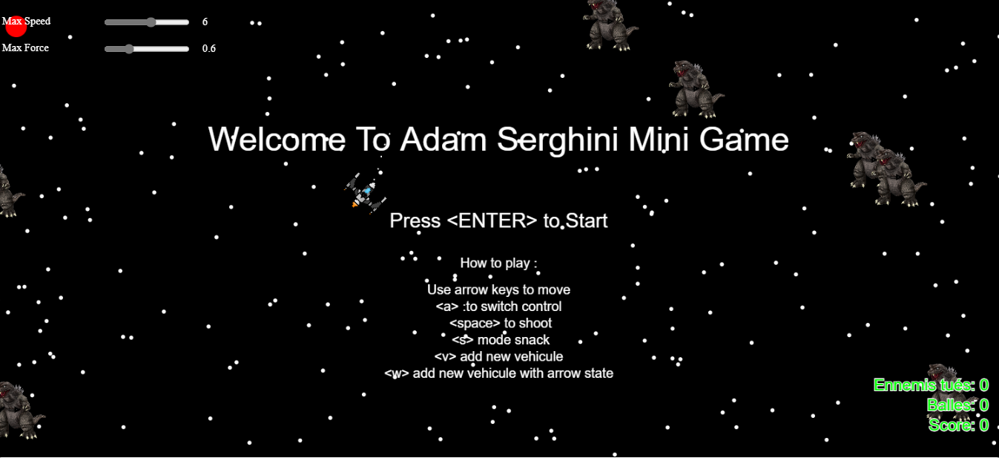

#  Mini Game — Jeu d’évitement et de tir (p5.js)



## 🎮 Présentation

**Mini Game** est un petit jeu développé avec la bibliothèque **[p5.js](https://p5js.org/)**.  
Le joueur contrôle un ou plusieurs avions et doit éviter les obstacles tout en éliminant les ennemis afin de réaliser le meilleur score possible.  
Il est également possible de tirer et de changer de mode de contrôle pour varier le gameplay.

🕹️ **Jouer en ligne :** [👉 Cliquez ici pour jouer](https://adamse22.github.io/mini_game/)

---

## 🧠 Fonctionnalités principales

- Contrôle fluide du véhicule à l’aide des touches directionnelles  
- Système de tir et de score  
- Gestion de plusieurs véhicules simultanément  
- Différents modes de comportement (normal, serpent, wander)  
- Obstacles dynamiques à éviter  
- Développement complet en **JavaScript / p5.js**

---

## ⚙️ Commandes du jeu

| Touche | Action |
|:-------|:--------|
| **Entrée (ENTER)** | Démarrer la partie |
| **Flèches directionnelles** | Déplacer le véhicule |
| **A** | Changer de véhicule contrôlé |
| **Espace (SPACE)** | Tirer |
| **S** | Activer le mode serpent |
| **V** | Ajouter un nouveau véhicule |
| **W** | Ajouter un véhicule avec comportement "wander" |

---

## 📁 Structure du projet

```
mini_game/
│
├── assets/              # Sons, polices ou ressources diverses
├── images/              # Images et captures d’écran
├── libraries/           # Librairies p5.js et extensions
│
├── boids.js             # Gestion du comportement de groupe
├── bullet.js            # Gestion des tirs
├── obstacle.js          # Gestion des obstacles
├── vehicle.js           # Classe principale du véhicule
├── sketch.js            # Point d’entrée du jeu (p5.js setup & draw)
│
├── index.html           # Page principale du jeu
├── style.css            # Styles du jeu
├── jsconfig.json        # Configuration JS
└── README.md            # Ce fichier
```

---

## 🚀 Installation locale

1. Clone le dépôt :
   ```bash
   git clone https://github.com/adamse22/mini_game.git
   ```

2. Ouvre le dossier :
   ```bash
   cd mini_game
   ```

3. Ouvre le fichier `index.html` dans ton navigateur préféré.

💡 Aucune installation supplémentaire n’est nécessaire — le jeu fonctionne directement dans le navigateur grâce à **p5.js**.

---

## 🧩 Technologies utilisées
- **p5.js** — Librairie graphique pour le dessin et les interactions  
- **JavaScript (ES6)** — Logique du jeu  
- **HTML5 / CSS3** — Interface et mise en page


---

## 👨‍💻 Auteur

**Adam Serghini**  
Ingénieur passionné par la **Data Science** et l’**Intelligence Artificielle**.  
Titulaire d’un **Master 2 en Intelligence Artificielle (IA)**.  

---

## 📜 Licence
Ce projet est distribué sous la **licence MIT**.  
Vous pouvez l’utiliser, le modifier et le partager librement, à condition de conserver la mention d’auteur originale.

